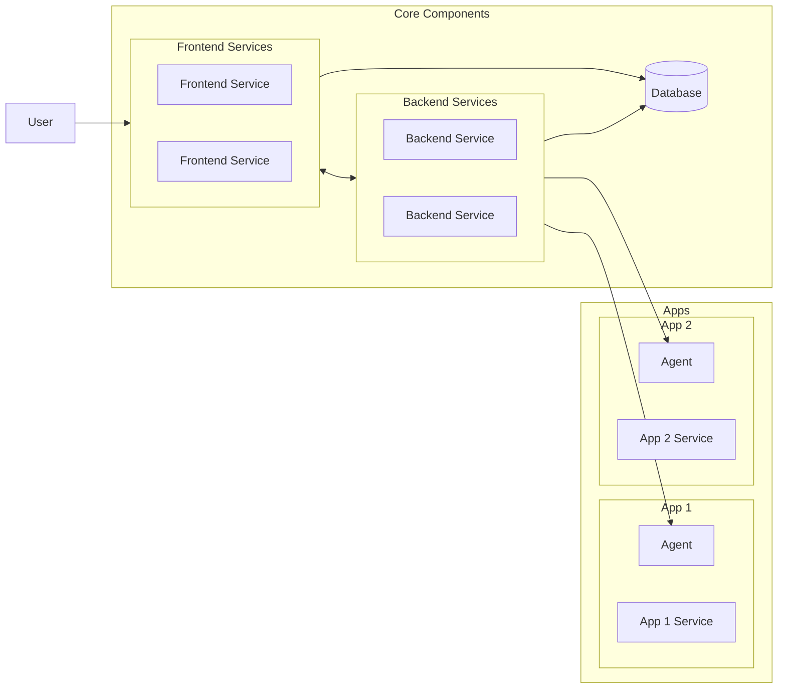

# 2026-09-01

## Today's Focus: Architecture of a platform

## Architecture Diagram

```mermaid
flowchart LR
   
    subgraph Core["Core Components"]
        
        
        subgraph Frontend["Frontend Services"]
            direction LR
            Frontend1[Frontend Service]
            Frontend2[Frontend Service]
        end

        subgraph Backend["Backend Services"]
          direction LR
            Backend1["Backend Service"]
            Backend2["Backend Service"]
        end
        
        Database[(Database)]
    end
    
    subgraph Apps["Apps"]
        direction LR

        subgraph App_1["App 1"]
            direction LR
            Agent1["Agent"]
            App1_service["App 1 Service"]
        end

      subgraph App_2["App 2"]
            direction LR
            Agent2["Agent"]
            App2_service["App 2 Service"]
      end
    end
    
    User --> Frontend
    Frontend<--> Backend
    Frontend --> Database
    Backend --> Database
    Backend --> Agent1
    Backend --> Agent2
```

