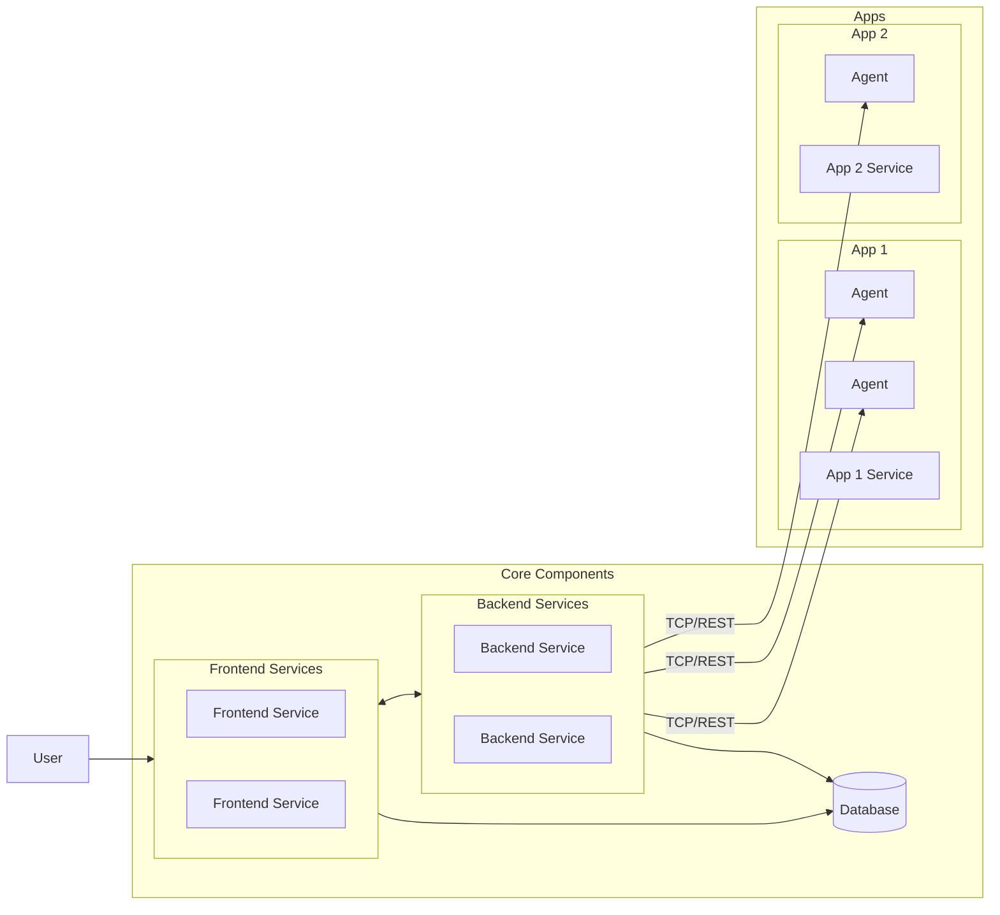
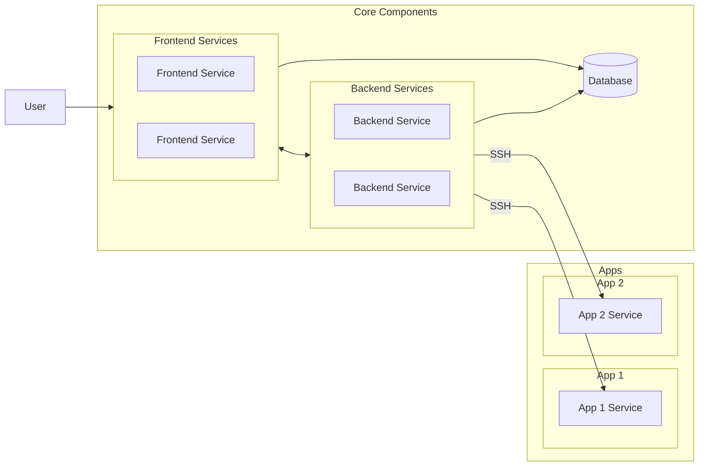

# 2026-09-02

## Today's Focus: Architecture thinking - Why are agents needed?

## Architecture Diagram with agents

### What is the function of agents?

To act as a controlled execution bridge between the backend services and local resources on app servers.

- Execute Java JAR
- Execute SH script
- Access local files
- Return execution status/result

### How are agents deployed, and what are their advantages and disadvantages?

1. VM-based deployment

- Easy access to local resources
- Less isolation
- Dependency conflicts (different agents may depend on different VM Java/runtime/library versions)

2. Podman-based deployment

- Better isolation
- Easier version management and simpler rollback
- Reduced host modification 
- Filesystem access is more complex (host filesystem must be explicitly mounted as a volume)
- Permission issues between host files and containerized agent

## Architecture Diagram without agents

### What happens without agents?

The backend services can still directly call the normal API, but cannot simply execute local scripts or access local files on the app servers. 
Another remote-execution mechanism is required, such as SSH. The problem is that the backend services may effectively receive
OS-level access to the app servers, which is a security risk.

## Trade-offs 

For a production architecture decision, support two flexible deployment options for agents (VM-based and Podman-based deployment).
Continue using agents on app servers to provide a controlled execution boundary and reduce the need of direct OS-level access from the platform.

