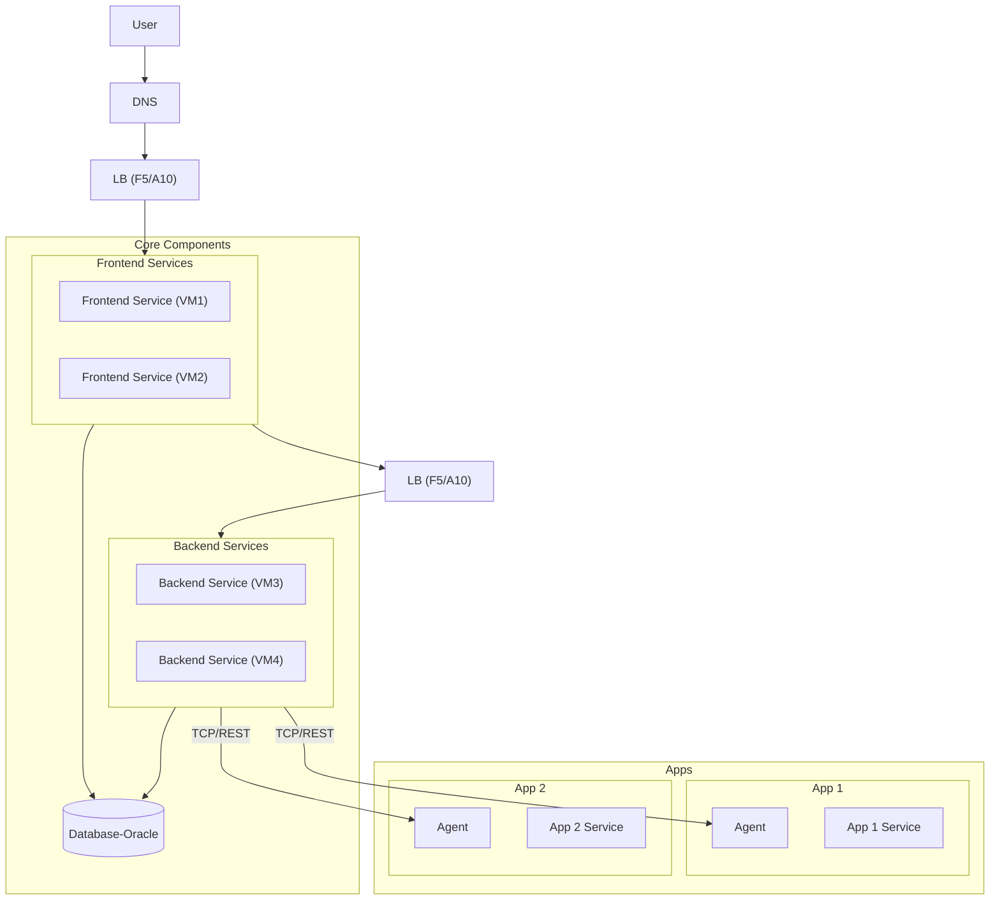
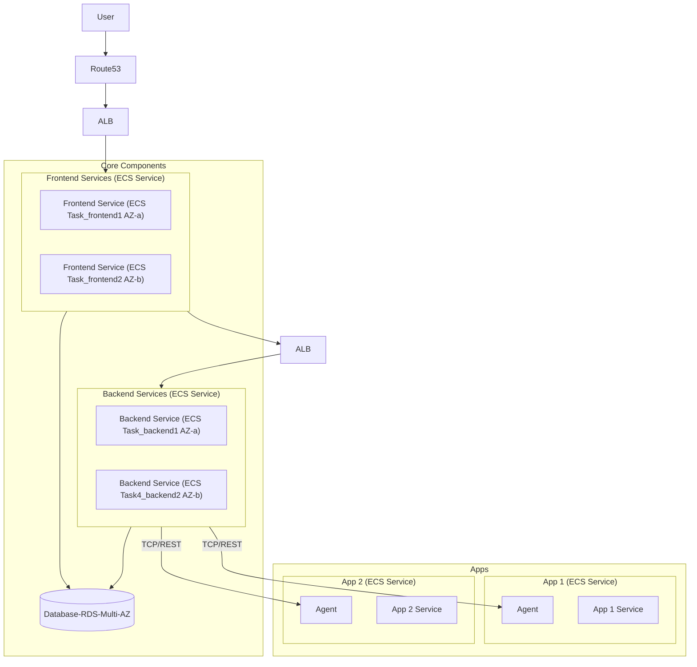

# 2026-09-05

## Today's Focus: AWS Migration

## Existing Architecture

- Frontend Services, Backend Services and Agents are all Java-Based program and are deployed using 
Podman on VMs. 
- For high availability, the Frontend Services and Backend Services are deployed in an active-active configuration across
  different VMs in different data centers.
- Oracle is used as the database and is deployed in an HA configuration  across different data centers. 

## Migrating to AWS Architecture

- Frontend Services and Backend Services are deployed as active-active ECS services, 
with multiple Fargate Tasks distributed across different AZs. 
- RDS is used as the database with Multi-AZ deployment for high availability. 
- Each Agent and its corresponding Application are deployed in the same ECS Fargate Task, 
  with the Agent running as a sidecar container.

## Migration Consideration

- VM + Podman -> ECS Fargate
- F5/A10 -> ALB
- Oracle -> RDS
- Database HA -> RDS Muti-AZ
- Active-active VMs -> Multi-AZ ECS FargateTasks
- Agent containers -> Sidecar containers

