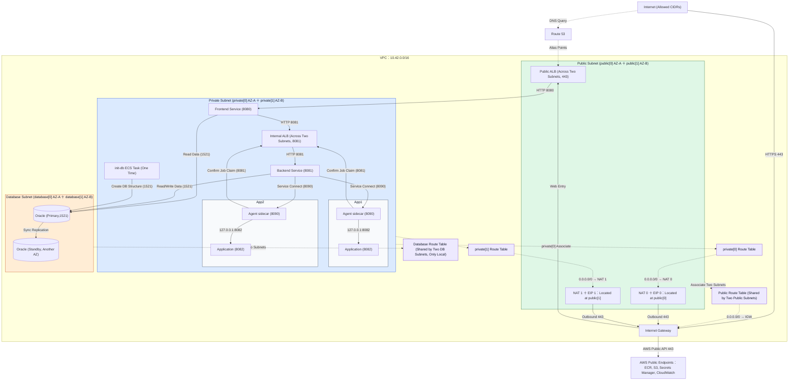

# 2026-09-12

## Today's Focus: AWS Project

## Network Architecture

## Mapping Between Subnets and Routes

| Terraform Subnet         | AZ   | CIDR            | Route Table                  |
|--------------------------|------|-----------------|------------------------------|
| `aws_subnet.public[0]`   | AZ-A | `10.42.0.0/24`  | `aws_route_table.public`     |
| `aws_subnet.public[1]`   | AZ-B | `10.42.1.0/24`  | `aws_route_table.public`     |
| `aws_subnet.private[0]`  | AZ-A | `10.42.10.0/24` | `aws_route_table.private[0]` |
| `aws_subnet.private[1]`  | AZ-B | `10.42.11.0/24` | `aws_route_table.private[1]` |
| `aws_subnet.database[0]` | AZ-A | `10.42.20.0/24` | `aws_route_table.database`   |
| `aws_subnet.database[1]` | AZ-B | `10.42.21.0/24` | `aws_route_table.database`   |

| Route Table  | VPC Local Route        | Default Route                  |
|--------------|------------------------|--------------------------------|
| `public`     | `10.42.0.0/16 → local` | `0.0.0.0/0 → Internet Gateway` |
| `private[0]` | `10.42.0.0/16 → local` | `0.0.0.0/0 → NAT 0`            |
| `private[1]` | `10.42.0.0/16 → local` | `0.0.0.0/0 → NAT 1`            |
| `database`   | `10.42.0.0/16 → local` | No Default Route               |

