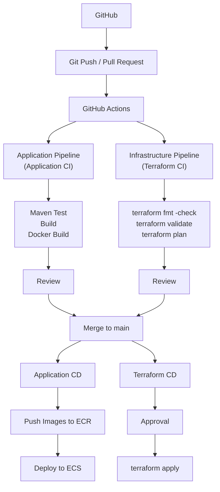

# 2026-09-17

## Today's Focus: Implement CI/CD in batch-platform

## CI/CD Architecture




## Deploy batch-platform Using CI/CD

## 1. Preparation Before Deployment

### 1.1 Import the Project

Import `batch-platform.zip` in AWS CloudShell

Unzip the project

```bash
unzip batch-platform.zip
```

Check the project

```bash
cd batch-platform
ls
```


Expected result
```text
frontend-service backend-service agent-service application-service
terraform        docs            pom.xml       README.md
```
### 1.2 Tool Requirements

Check the version of tools

```bash
aws --version
terraform version
docker version
docker info 
jq --version
python3 --version
gh --version
git --version
```

| Tool            | Requirement                    | Instruction                                                         |
|-----------------|--------------------------------|---------------------------------------------------------------------|
| AWS CLI         | v2.x                           | Calls AWS APIs from CloudShell or terminal                          |
| Terraform       | `>=1.11.0` and `<2.0.0`        | Must match `terraform/version.tf`                                   |
| Docker          | Client and daemon must work    | Builds four service images                                          |
| jq              | 1.6 or later preferred         | Parses Terraform JSON outputs                                       |
| Python          | 3.9 or later preferred         | Runs helper scripts                                                 |
| GitHub CLI (gh) | Current stable 2.x recommended | Performs GitHub login, PR, GitHub Actions                           |
| Git             | v2.x                           | Manage Git repositories, commits, branches and push/pull operations |
