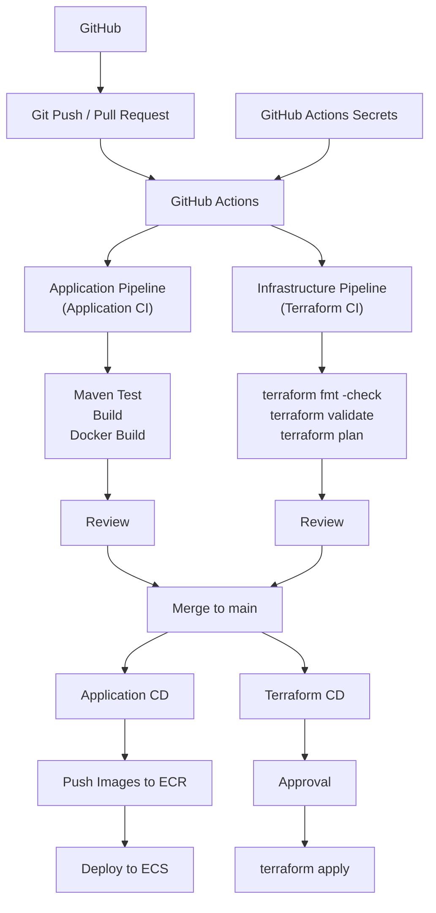

# 2026-09-18

## Today's Focus: Implement CI/CD in batch-platform

## CI/CD Architecture




## Deploy batch-platform Using CI/CD

## 1. Preparation Before Deployment

### 1.1 Import the Project

Clone `batch-platform` project from GitHub

Check the project

```bash
ls -la
```


Expected result
```text
frontend-service backend-service agent-service application-service
terraform        docs            pom.xml       README.md
.dockerignore    .gitignore      
```
### 1.2 Tool Requirements

Check the version of tools

```bash
aws --version
terraform version
docker version
docker info 
jq --version
python3 --version
gh --version
git --version
```

| Tool            | Requirement                    | Instruction                                                         |
|-----------------|--------------------------------|---------------------------------------------------------------------|
| AWS CLI         | v2.x                           | Calls AWS APIs from CloudShell or terminal                          |
| Terraform       | `>=1.11.0` and `<2.0.0`        | Must match `terraform/version.tf`                                   |
| Docker          | Client and daemon must work    | Builds four service images                                          |
| jq              | 1.6 or later preferred         | Parses Terraform JSON outputs                                       |
| Python          | 3.9 or later preferred         | Runs helper scripts                                                 |
| GitHub CLI (gh) | Current stable 2.x recommended | Performs GitHub login, PR, GitHub Actions                           |
| Git             | v2.x                           | Manage Git repositories, commits, branches and push/pull operations |

### 1.3 Verify Git Really the Private Files

```bash
git check-ignore -v terraform/cicd.tfvars terraform/cicd.runtime.tfvars terraform/backend.hcl
```

Expected result

```text
PROJECT/AWS/batch-platform/.gitignore:7:**/cicd.tfvars  terraform/cicd.tfvars
PROJECT/AWS/batch-platform/.gitignore:8:**/cicd.runtime.tfvars  terraform/cicd.runtime.tfvars
PROJECT/AWS/batch-platform/.gitignore:5:**/backend.hcl  terraform/backend.hcl
```

## 2. Authenticate Locally

Run

```bash
export AWS_PROFILE=batch-lab
export AWS_REGION=us-east-1
export AWS_DEFAULT_REGION="$AWS_REGION"
export AWS_PAGER=""
export AWS_DEFAULT_OUTPUT=json

aws sts get-caller-identity
gh auth login
gh auth status
```

Expected Result

```text
#aws sts get-caller-identity
{
  "UserID": "...",
  "Account": "...",
  "Arn": "arn:aws:iam::..."
}
#gh auth status
github.com
  ✓ Logged in to github.com account ... (keyring)
  - Active account: true
  - Git operations protocol: https
  - Token: ...
  - Token scopes: ...
```

## 3. Run One-Time Setup

One-time setup scrip `setup-cicd.py` includes

```text
setup-cicd.py
      │
      ├── CI/CD Bootstrap
      │     ├── S3 State Bucket
      │     ├── GitHub OIDC
      │     ├── IAM Roles
      │     ├── GitHub Secrets / Variables
      │     └── Environments
      │
      └── Terraform initial apply
                │
                ├── VPC/Subnets/NAT
                ├── Security Groups
                ├── ALB
                ├── RDS Oracle
                ├── ECR
                ├── ECS Cluster
                ├── Task Definitions
                └── supporting resources
```

Run

```bash
export BATCH_ACCOUNT_ID="$(aws sts get-caller-identity --query Account --output text)"

python3 docs/scripts/setup-cicd.py \
  --account "$BATCH_ACCOUNT_ID" \
  --solo

unset BATCH_ACCOUNT_ID
```

Expected result

```text
STATE BUCKET READY: ...
Apply complete! Resources: ...
DATABASE CHECKPOINT: new
SETUP COMPLETE. Open a PR; use [deploy] in its title for the first complete application deployment.
Keep terraform/cicd.tfvars LOCAL and ignored. Commit only terraform/.terraform.lock.hcl.
```

## 4. Check GitHub Configuration

Run

```bash
gh secret list
gh variable list
```

Expected secret names

```text
BATCH_AWS_ACCOUNT_ID
BATCH_AWS_ROLE_ARN
BATCH_PLAN_ROLE_ARN
BATCH_PR_PLAN_ROLE_ARN
BATCH_INFRA_ROLE_ARN
BATCH_STATE_BUCKET
BATCH_STATE_KEY
BATCH_TFVARS
```

Expected non-sensitive variables

```text
BATCH_AWS_REGION
BATCH_PROJECT_DIR
BATCH_CD_PAUSED
```

## 5. Open the First PR

Run

```bash
git switch -c batch-platform-cicd
git add .
git status --short
git diff --cached --stat
git commit -m "First batch-platform CI/CD deployment[deploy]"
git push -u origin batch-platform-cicd

gh pr create \
  --base main \
  --head batch-platform-cicd \
  --title "First batch-platform CI/CD deployment[deploy]" \
  --body "First batch-platform CI/CD deployment[deploy]"
```
