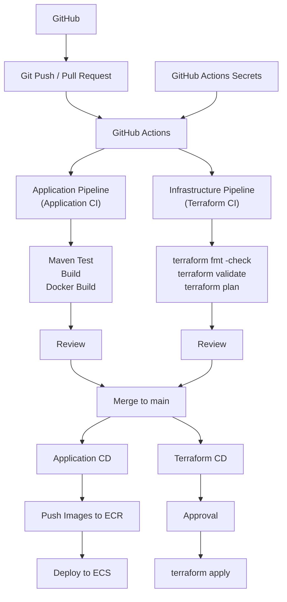

# 2026-09-19

## Today's Focus: Implement CI/CD in batch-platform

## CI/CD Architecture




## Deploy batch-platform Using CI/CD

## 1. Preparation Before Deployment

### 1.1 Import the Project

Clone `batch-platform` project from GitHub

Check the project

```bash
ls -la
```


Expected result
```text
frontend-service backend-service agent-service application-service
terraform        docs            pom.xml       README.md
.dockerignore    .gitignore      
```
### 1.2 Tool Requirements

Check the version of tools

```bash
aws --version
terraform version
jq --version
python3 --version
gh --version
git --version
```

| Tool            | Requirement                    | Instruction                                                         |
|-----------------|--------------------------------|---------------------------------------------------------------------|
| AWS CLI         | v2.x                           | Calls AWS APIs from CloudShell or terminal                          |
| Terraform       | `>=1.11.0` and `<2.0.0`        | Must match `terraform/version.tf`                                   |
| jq              | 1.6 or later preferred         | Parses Terraform JSON outputs                                       |
| Python          | 3.9 or later preferred         | Runs helper scripts                                                 |
| GitHub CLI (gh) | Current stable 2.x recommended | Performs GitHub login, PR, GitHub Actions                           |
| Git             | v2.x                           | Manage Git repositories, commits, branches and push/pull operations |

### 1.3 Verify Git Really the Private Files

```bash
git check-ignore -v terraform/cicd.tfvars terraform/cicd.runtime.tfvars terraform/backend.hcl
```

Expected result

```text
PROJECT/AWS/batch-platform/.gitignore:7:**/cicd.tfvars  terraform/cicd.tfvars
PROJECT/AWS/batch-platform/.gitignore:8:**/cicd.runtime.tfvars  terraform/cicd.runtime.tfvars
PROJECT/AWS/batch-platform/.gitignore:5:**/backend.hcl  terraform/backend.hcl
```

## 2. Authenticate Locally

Run

```bash
export AWS_PROFILE=batch-lab
export AWS_REGION=us-east-1
export AWS_DEFAULT_REGION="$AWS_REGION"
export AWS_PAGER=""
export AWS_DEFAULT_OUTPUT=json

aws sts get-caller-identity
gh auth login
gh auth status
```

Expected Result

```text
#aws sts get-caller-identity
{
  "UserID": "...",
  "Account": "...",
  "Arn": "arn:aws:iam::..."
}
#gh auth status
github.com
  ✓ Logged in to github.com account ... (keyring)
  - Active account: true
  - Git operations protocol: https
  - Token: ...
  - Token scopes: ...
```

## 3. Run One-Time Setup

One-time setup scrip `setup-cicd.py` includes

```text
setup-cicd.py
      │
      ├── CI/CD Bootstrap
      │     ├── S3 State Bucket
      │     ├── GitHub OIDC
      │     ├── IAM Roles
      │     ├── GitHub Secrets / Variables
      │     └── Environments
      │
      └── Terraform initial apply
                │
                ├── VPC/Subnets/NAT
                ├── Security Groups
                ├── ALB
                ├── RDS Oracle
                ├── ECR
                ├── ECS Cluster
                ├── Task Definitions
                └── supporting resources
```

Run

```bash
export BATCH_ACCOUNT_ID="$(aws sts get-caller-identity --query Account --output text)"

python3 docs/scripts/setup-cicd.py \
  --account "$BATCH_ACCOUNT_ID" \
  --solo

unset BATCH_ACCOUNT_ID
```

Expected result

```text
STATE BUCKET READY: ...
Apply complete! Resources: ...
DATABASE CHECKPOINT: new
SETUP COMPLETE. Open a PR; use [deploy] in its title for the first complete application deployment.
Keep terraform/cicd.tfvars LOCAL and ignored. Commit only terraform/.terraform.lock.hcl.
```

Push `.terraform.lock.hcl` to git

## 4. Check GitHub Configuration

Run

```bash
gh secret list
gh variable list
```

Expected secret names

```text
BATCH_AWS_ACCOUNT_ID
BATCH_AWS_ROLE_ARN
BATCH_PLAN_ROLE_ARN
BATCH_PR_PLAN_ROLE_ARN
BATCH_INFRA_ROLE_ARN
BATCH_STATE_BUCKET
BATCH_STATE_KEY
BATCH_TFVARS
```

Expected non-sensitive variables

```text
BATCH_AWS_REGION
BATCH_PROJECT_DIR
BATCH_CD_ENABLED
BATCH_CD_PAUSED
```

## 5. Open the First PR

Run

```bash
git switch -c batch-platform-cicd
git add .
git status --short
git diff --cached --stat
git commit -m "First batch-platform CI/CD deployment[deploy]"
git push -u origin batch-platform-cicd

gh pr create \
  --base main \
  --head batch-platform-cicd \
  --title "First batch-platform CI/CD deployment[deploy]" \
  --body "First batch-platform CI/CD deployment[deploy]"
```

## 6. Verify PR CI

Run

```bash
gh pr checks
gh run list --limit 5
```

Expected result

```text
Application CI      pass
Terraform CI        pass
Terraform PR plan   waiting/pass
CI gate             waiting/pass
```

Review before deploy to `terraform-pr-plan`

## 7. Review and Merge the First PR

Run

```bash
gh pr merge --squash \
  --delete-branch \
  --subject "First batch-platform CI/CD deployment [deploy]"
  
gh run list --limit 5
gh run view <RUN_ID> --log-failed
```

Expected result

```text
Success
```

## 8. Smoke Test

### 8.1 Get the Frontend URL and UI Password

Get URL

```bash
terraform -chdir=terraform output -raw url
```

Expected result

```text
http://batch-platform-lab-pub-xxxx.us-east-1.elb.amazonaws.com
```

Get UI password

```bash
export BATCH_RUNTIME_SECRET="$(terraform -chdir=terraform output -raw runtime_secret_arn)"

aws secretsmanager get-secret-value \
  --secret-id "$BATCH_RUNTIME_SECRET" \
  --query SecretString \
  --output text | python3 -c 'import json,sys; print(json.load(sys.stdin)["ui_password"])'
```

Expected result

```text
<generated password>
```

Login

```text
Username: operator
Password: value from ui_password
```

### 8.2 Test Batch Job

#### 8.2.1 Test a `SH` job from the frontend UI

1. Select `app1`
2. Select job type `SH Script`
3. Enter a business date, for example `2026-09-14`
4. Click `Submit`
5. Wait a few seconds
6. Check the job table on the page

Expected result

```text
A new job record appears in the job table.
The job status changes from SUBMITTED/RUNNING to SUCCEEDED.
The result shows that the shell batch job was executed by app1.
```

#### 8.2.2 Test an `API` job from the frontend UI

1. Select `app2`
2. Select job type `API Call`
3. Enter a business date, for example `2026-09-14`
4. Click `Submit`
5. Wait a few seconds
6. Check the job table on the page

Expected result

```text
A new app2 API job appears.
The final status becomes SUCCEEDED.
The result shows that the API batch job was executed by app2.
```

## 9. Normal Daily Application Change

Run

```bash
git switch -c <branch-name>
git add .
git status --short
git diff --cached --stat
git commit -m "Update <service-name>"
git push -u origin <branch-name>

gh pr create \
  --base main \
  --head batch-platform-cicd \
  --title "Update <service-name>" \
  --body "Update <service-name>"
```

## 10. Normal Infrastructure Change

Run

```bash
git switch -c <branch-name>
git add .
git status --short
git diff --cached --stat
git commit -m "Update <service-name>"
git push -u origin <branch-name>

gh pr create \
  --base main \
  --head batch-platform-cicd \
  --title "Update <service-name>" \
  --body "Update <service-name>"
```

## 11. Cleanup

### 11.1 Pause CD

Run

```bash
gh variable set BATCH_CD_PAUSED --body "true"
```

Wait for running deploymnets to finish and reject pending deploymnet approvals

```bash
gh run list --workflow batch-platform.yml --branch main --limit 5
```

### 11.2 Set Cleanup Environment

Run

```bash
export AWS_REGION=us-east-1
export AWS_DEFAULT_REGION="$AWS_REGION"
export AWS_PAGER=""
export BATCH_EXPECTED_ACCOUNT_ID="$(aws sts get-caller-identity --query Account --output text)"
export BATCH_NAME=batch-platform-lab
aws sts get-caller-identity
```

### 11.3 Cleanup Resources

Run

```bash
python3 docs/scripts/cleanup.py prepare
python3 docs/scripts/cleanup.py stop
python3 docs/scripts/cleanup.py database
python3 docs/scripts/cleanup.py ecr
python3 docs/scripts/cleanup.py logs-bucket
terraform -chdir=terraform plan -destroy -var-file=cicd.tfvars -var=deploy_services=true -out=destroy-final.tfplan
terraform -chdir=terraform apply destroy-final.tfplan
python3 docs/scripts/cleanup.py extras
python3 docs/scripts/cleanup.py verify
```

Expected result

```text
PASS: Terraform has no managed resources; project checks passed.
```

### 11.4 Remove Terraform State

Run

```bash
python3 docs/scripts/cleanup.py state-bucket
```

Expected result

```text
STATE BUCKET DELETED: batch-tfstate-123456789012-us-east-1
FINISHED. Do not run Terraform using this removed project state.
```

### 11.5 Remove GitHub CI/CD Runtime Configuration

Remove project secrets

```bash
for secret in \
  BATCH_AWS_ACCOUNT_ID \
  BATCH_AWS_ROLE_ARN \
  BATCH_PLAN_ROLE_ARN \
  BATCH_PR_PLAN_ROLE_ARN \
  BATCH_INFRA_ROLE_ARN \
  BATCH_STATE_BUCKET \
  BATCH_STATE_KEY \
  BATCH_TFVARS
do
  gh secret delete "$secret"
done
```

Remove project variables

```bash
for variable in \
  BATCH_AWS_REGION \
  BATCH_PROJECT_DIR \
  BATCH_CD_PAUSED \
  BATCH_CD_ENABLED
do
  gh variable delete "$variable"
done
```

Delete `terraform/.terraform.lock.hcl` in GitHub

### 11.6 Remove Local Runtime Files

Run

```bash
rm -f terraform/cicd.tfvars 
rm -f terraform/backend.hcl 
rm -f terraform/destroy-final.tfplan 
rm -rf terraform/.terraform
rm -rf .cicd-work 
rm -rf cleanup-work
```

### 11.7 Verify Cleanup

Run

```bash
gh secret list
gh variable list
git status --short
```

### 11.8 Enable Workflow

Run

```bash
gh workflow disable batch-platform.yml
```

Verify

```bash
gh workflow list --all
```

Expected result

```text
NAME            STATE            
Batch Platform  disabled_manually
```

Cleanup finished
