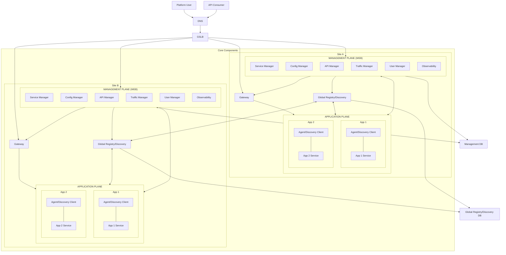

# 2026-09-21

## Today's Focus: Architecture of management-platform

## Architecture Diagram

```mermaid
flowchart TB

  GSLB["GSLB"]

  subgraph SITES["Core Components"]
    direction LR

    subgraph SITEA["Site A"]
      direction TB

      subgraph MPA["MANAGEMENT PLANE (WEB)"]
        direction TB
        SMA["Service Manager"]
        CMA["Config Manager"]
        AMA["API Manager"]
        TMA["Traffic Manager"]
        USERA["User Manager"]
        OMA["Observability"]
      end

      GBDA["Global Registry/Discovery"]
      GWA["Gateway"]

      subgraph APA["APPLICATION PLANE"]
        direction TB

        subgraph APP1A["App 1"]
          direction TB
          AGENT1A["Agent/Discovery Client"]
          SERVICE1A["App 1 Service"]
          AGENT1A --- SERVICE1A
        end

        subgraph APP2A["App 2"]
          direction TB
          AGENT2A["Agent/Discovery Client"]
          SERVICE2A["App 2 Service"]
          AGENT2A --- SERVICE2A
        end
      end

    end


    subgraph SITEB["Site B"]
      direction TB

      subgraph MPB["MANAGEMENT PLANE (WEB)"]
        direction TB
        SMB["Service Manager"]
        CMB["Config Manager"]
        AMB["API Manager"]
        TMB["Traffic Manager"]
        USERB["User Manager"]
        OMB["Observability"]
      end
      
      GBDB["Global Registry/Discovery"]
      GWB["Gateway"]
      
      subgraph APB["APPLICATION PLANE"]
        direction TB

        subgraph APP1B["App 1"]
          direction TB
          AGENT1B["Agent/Discovery Client"]
          SERVICE1B["App 1 Service"]
          AGENT1B --- SERVICE1B
        end

        subgraph APP2B["App 2"]
          direction TB
          AGENT2B["Agent/Discovery Client"]
          SERVICE2B["App 2 Service"]
          AGENT2B --- SERVICE2B
        end
      end

    end
  end
  
  MDB["Management DB"]
  GDB["Global Registry/Discovery DB"]
  PUser["Platform User"]
  AUser["API Consumer"]

  PUser --> DNS
  AUser --> DNS
  DNS --> GSLB
  GSLB --> MPA
  GSLB --> MPB
  GSLB --> GWA --> APA
  GSLB --> GWB --> APB
  MPA --> MDB
  MPB --> MDB
  GBDA <--> GBDB
  GBDA --> GDB
  GBDA <--> APA
  GBDB --> GDB
  GBDB <--> APB
  MPA --> GBDA
  MPB --> GBDB
  MPA <--> APA
  MPB <--> APB
  MPA --> GWA
  MPB --> GWB
  

```
