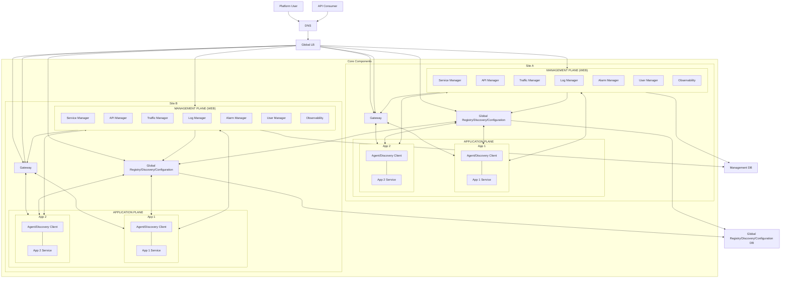

# 2026-09-22

## Today's Focus: Architecture of management-platform

## Architecture Diagram

## Architecture Overview

### 1. Global LB (GLB)

Distributes incoming traffic across multiple sites. It monitors site availability 
and routes requests to a healthy site based on routing policies, enabling multi-site 
high availability and failover

### 2. Management Plane 

A centralized management platform for microservices, includes seven modules:

- **Service Manager**  
  Provides centralized application and service management. 
  It integrates with the Global Registry/Discovery/Configuration component to display 
  service registration, instance health, metadata, and configuration. 
  Authorized users can view and modify application configurations and service information.

- **API Manager**  
  Manages the API lifecycle, including API publishing, authorization, access control, 
  allowlists/blocklists, rate limiting, and traffic policies. It integrates with the Gateway 
  to control which applications or consumers are authorized to access specific APIs.

- **Traffic Manager**  
  Provides service dependency, request path, and distributed tracing views by integrating with 
  SkyWalking. It helps users analyze cross-service calls, latency, and failed requests.

- **Log Manager**  
  Provides centralized log search and analysis by integrating with the ELK stack. Users can 
  query application and platform logs through the Management Plane.

- **Alarm Manager**  
  Provides centralized alert management. Users can define alert rules and view active, and 
  resolved alerts through the Management Plane.

- **User Manager**  
  Manages Management Platform users, roles, and access permissions.

- **Observability**  
  Provides centralized metrics dashboards and system health monitoring by integrating with 
  Grafana and the underlying monitoring infrastructure.

### 3. Global Registry/Discovery/Configuration (GRDC)

Provides global service registration, service discovery, and centralized runtime configuration across both sites.
Registry, discovery, and configuration state is synchronized across both sites 
to support high availability and local service access. 

### 4. Gateway

Provides a unified entry point for external and cross-system API calls.
It performs authentication and authorization, API routing, access control, rate limiting, 
and traffic policy enforcement based on policies managed by the Management Plane.

### 5. Application Pane:

Each application includes:

- **Agent/Discovery Client**  
  It integrates with components such as Filebeat, SkyWalking Agent, Node Exporter, and the 
  Service Discovery Client to collect logs, traces, infrastructure metrics, and service registration information, 
  and exposes this information through the Management Plane.
  Service registration and discovery information is exchanged with Global Registry/Discovery (GRDC).

  
- **App Service**  
  Business microservice

### 6. Management DB

### 7. Global Registry/Discovery/Configuration DB (GRDC DB)

