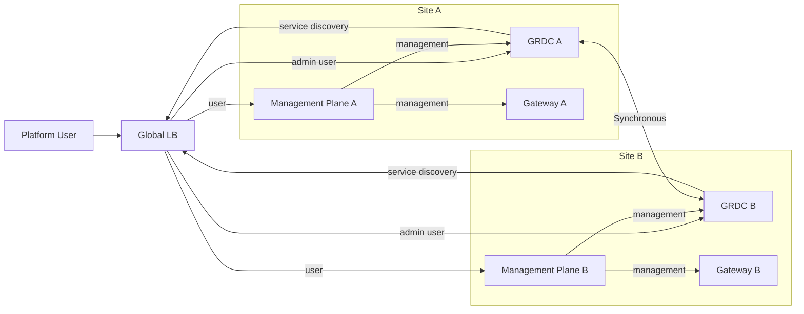
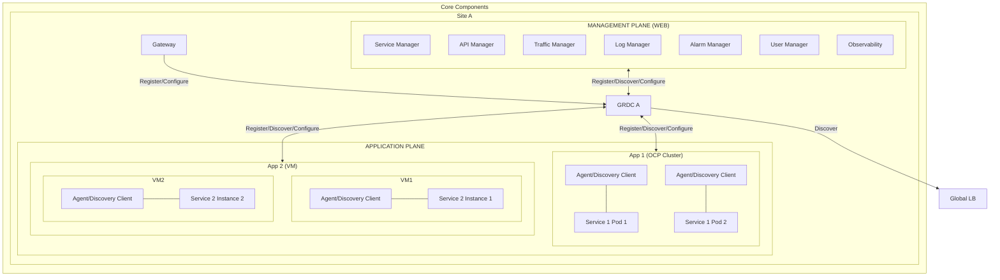
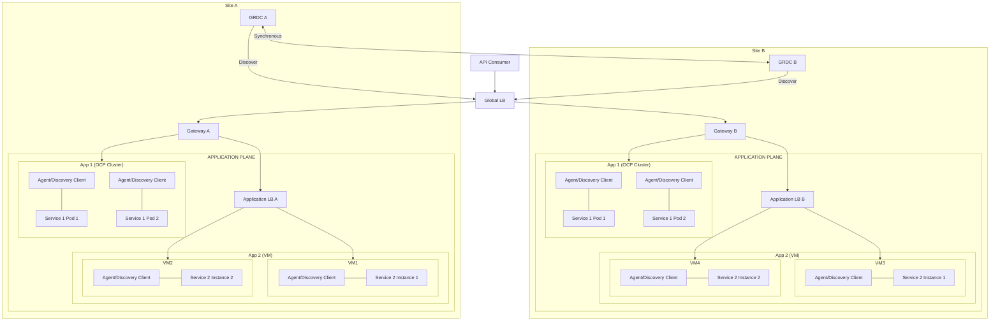
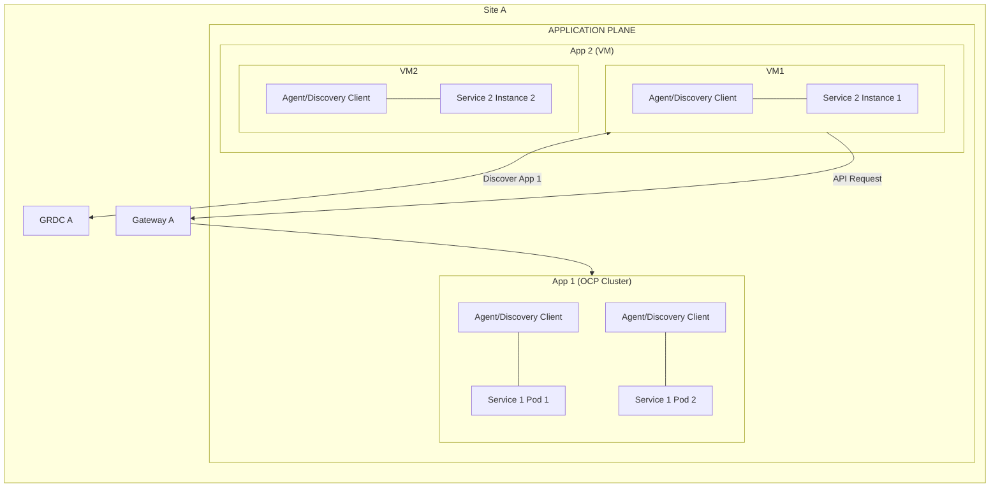
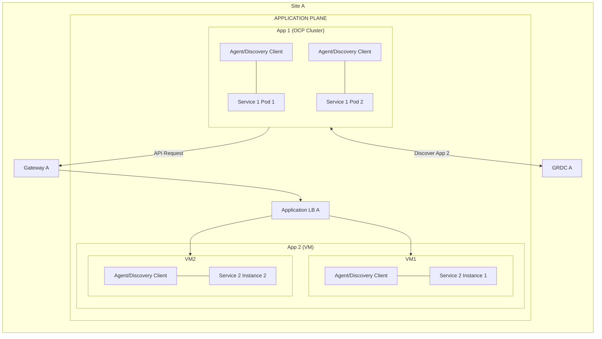
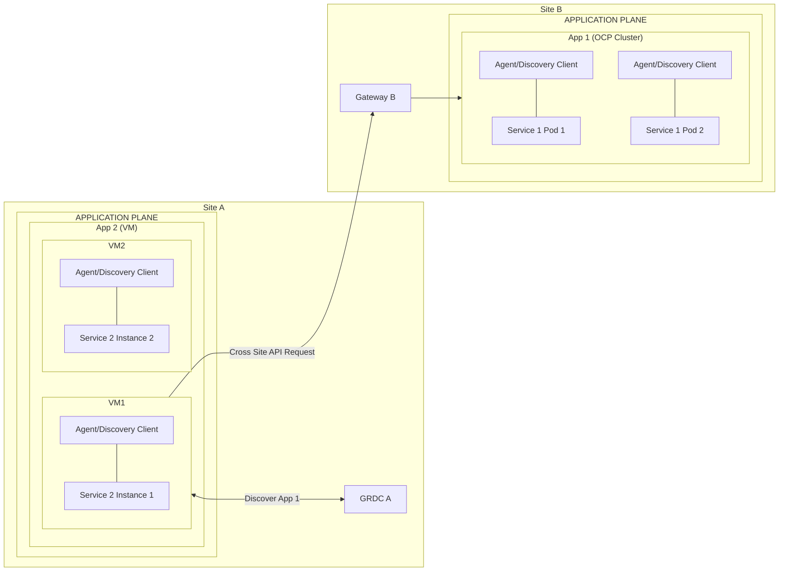
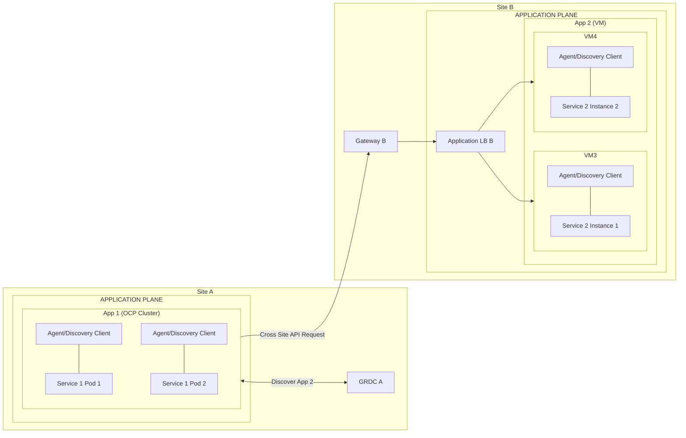

# 2026-09-24

## Today's Focus: Architecture of management-platform

## Architecture Diagram

```mermaid
flowchart TB

  GSLB["Global LB"]

  subgraph SITES["Core Components"]
    direction LR

    subgraph SITEA["Site A"]
      direction TB

      subgraph MPA["MANAGEMENT PLANE (WEB)"]
        direction TB
        SMA["Service Manager"]
        AMA["API Manager"]
        TMA["Traffic Manager"]
        LMA["Log Manager"]
        ALMA["Alarm Manager"]
        USERA["User Manager"]
        OMA["Observability"]
      end

      GBDA["Global Registry/Discovery/Configuration"]
      GWA["Gateway"]

      subgraph APA["APPLICATION PLANE"]
        direction TB

        subgraph APP1A["App 1 (OCP Cluster)"]
          direction TB
          AGENT1A1["Agent/Discovery Client"]
          SERVICE1A1["Service 1 Pod 1"]
          AGENT1A1 --- SERVICE1A1

          direction TB
          AGENT1A2["Agent/Discovery Client"]
          SERVICE1A2["Service 1 Pod 2"]
          AGENT1A2 --- SERVICE1A2
        end
        
        ALBA["Application LB A"]
        
        subgraph APP2A["App 2 (VM)"]
          direction TB
          subgraph VM1
            AGENT2A1["Agent/Discovery Client"]
            SERVICE2A1["Service 2 Instance 1"]
            AGENT2A1 --- SERVICE2A1
          end
          subgraph VM2
            AGENT2A2["Agent/Discovery Client"]
            SERVICE2A2["Service 2 Instance 2"]
            AGENT2A2 --- SERVICE2A2
          end

        end

        ALBA --> VM1
        ALBA --> VM2
      end

    end


    subgraph SITEB["Site B"]
      direction TB

      subgraph MPB["MANAGEMENT PLANE (WEB)"]
        direction TB
        SMB["Service Manager"]
        AMB["API Manager"]
        TMB["Traffic Manager"]
        LMB["Log Manager"]
        ALMB["Alarm Manager"]
        USERB["User Manager"]
        OMB["Observability"]
      end
      
      GBDB["Global Registry/Discovery/Configuration"]
      GWB["Gateway"]
      
      subgraph APB["APPLICATION PLANE"]
        direction TB

        subgraph APP1B["App 1 (OCP Cluster)"]
          direction TB
          AGENT1B1["Agent/Discovery Client"]
          SERVICE1B1["Service 1 Pod 1"]
          AGENT1B1 --- SERVICE1B1

          direction TB
          AGENT1B2["Agent/Discovery Client"]
          SERVICE1B2["Service 1 Pod 2"]
          AGENT1B2 --- SERVICE1B2
        end
        ALBB["Application LB B"]
        subgraph APP2B["App 2 (VM)"]
          direction TB
            subgraph VM3
              AGENT2B1["Agent/Discovery Client"]
              SERVICE2B1["Service 2 Instance 1"]
              AGENT2B1 --- SERVICE2B1
            end
            subgraph VM4
              AGENT2B2["Agent/Discovery Client"]
              SERVICE2B2["Service 2 Instance 2"]
              AGENT2B2 --- SERVICE2B2
            end
          
        end
        
        ALBB --> VM3
        ALBB --> VM4
      end

    end
  end
  
  MDB["Management DB"]
  GDB["Global Registry/Discovery/Configuration DB"]
  PUser["Platform User"]
  AUser["API Consumer"]

  PUser --> GSLB
  AUser --> GSLB
  GSLB --> MPA
  GSLB --> MPB
  GSLB --> GWB
  GSLB --> GWA
  
  GWB --> ALBB
  GWB --> GBDB
  GWB <--> APP1B
  APP2B --> GWB
  
  GWA --> ALBA
  GWA --> GBDA
  GWA <--> APP1A
  APP2A --> GWA


  GBDA <--> GSLB
  GBDB <--> GSLB
  MPA --> MDB
  MPB --> MDB
  GBDA <--> GBDB
  GBDA --> GDB
  GBDA <--> APP1A
  GBDA <--> APP2A
  GBDB --> GDB
  GBDB <--> APP1B
  GBDB <--> APP2B
  MPA <--> GBDA
  MPB <--> GBDB
  MPA <--> APP1A
  MPA <--> APP2A
  MPB <--> APP1B
  MPB <--> APP2B
  MPA --> GWA
  MPB --> GWB

```

-----

## Architecture Overview

### 1. Global LB (GLB)

Distributes incoming traffic across multiple sites. The GRDC updates the service status 
information in the Global LB's service status table, and the Global LB uses the contents 
of this table to route requests to sites that are operating normally.

### 2. Management Plane

A centralized web-based management platform for microservices, including seven modules:
- **Service Manager**  
  Provides centralized application and service management.
  It integrates with the Global Registry/Discovery/Configuration component to display
  service registration, instance health, metadata, and configuration.
  Authorized users can view and modify application configurations and service information.

- **API Manager**  
  Manages the API lifecycle, including API publishing, authorization, access control,
  allowlists/blocklists, rate limiting, and traffic policies. It integrates with the Gateway
  to control which applications or consumers are authorized to access specific APIs.

- **Traffic Manager**  
  Provides service dependency, request path, and distributed tracing views by integrating with
  SkyWalking. It helps users analyze cross-service calls, latency, and failed requests.

- **Log Manager**  
  Provides centralized log search and analysis by integrating with the ELK stack. Users can
  query application and platform logs through the Management Plane.

- **Alarm Manager**  
  Provides centralized alert management. Users can define alert rules and view active, and
  resolved alerts through the Management Plane.

- **User Manager**  
  Manages Management Platform users, roles, and access permissions.

- **Observability**  
  Provides centralized metrics dashboards and system health monitoring by integrating with
  Grafana and the underlying monitoring infrastructure.

### 3. Global Registry/Discovery/Configuration (GRDC)

Provides global service registration, service discovery, and centralized runtime configuration across both sites.
Registry, discovery, and configuration state is synchronized across both sites
to support high availability and local service access.

### 4. Gateway

Provides a unified entry point for external and cross-system API calls.
It performs authentication and authorization, API routing, access control, rate limiting,
and traffic policy enforcement based on policies managed by the Management Plane.

### 5. Application Pane:

Each application includes:

- **Agent/Discovery Client**  
  It integrates with components such as Filebeat, SkyWalking Agent, Node Exporter, and the
  Service Discovery Client to collect logs, traces, infrastructure metrics, and service registration information,
  and exposes this information through the Management Plane.
  Service registration and discovery information is exchanged with Global Registry/Discovery (GRDC).

- **App Service**  
  Business microservice

For VM application:

- **Application LB**  
  Forward traffic to different VM services.

### 6. Management DB

### 7. Global Registry/Discovery/Configuration DB (GRDC DB)

----

## Traffic Flows

## 1. Platform User Access

Standard users access the Management Plane through the Global LB,
while admin users can also access GRDC web directly.
The Management Plane integrates with GRDC and Gateway for centralized service, configuration, and API management.
The GLB selects a site based on service availability on the GRDC.

- **Standard User:**
  - DNS → Global LB → Management Plane A/B (Web)

- **Admin User:**
  - DNS → Global LB → Management Plane A/B (Web)
  - DNS -> Global LB -> GRDC A/B (Web)

----

## 2. Service Registration, Discovery and Configuration

GRDC maintains and synchronizes service availability, site information, and configuration across both sites.

- **Register/Discover/Configure**

  - Management Plane: Interact with GRDC to manage service registration, service discovery, and service configuration via the web interface.
  - Application Plane: Applications use their Agent/Discovery Client to register services, discover available services,
    and retrieve runtime configurations from GRDC.

- **Register/Configure**

  - Gateway: Register the gateway itself and configure it to the GRDC.

- **Discover**

  - Global LB: The GRDC updates the service status information in the Global LB's service status table, 
  and the Global LB uses the contents of this table to route requests to sites that are operating normally.

----

## 3. External User API Call

External API consumers access published APIs through DNS and the Global
Load Balancer. The GRDC updates the service status information in the Global LB's 
service status table, and the Global LB uses the contents of this table to route 
requests to sites that are operating normally. The site
Gateway performs authentication, authorization, traffic control, and API
routing before forwarding the request to the target application.
The Application LB checks service availability via service health check endpoints.

- **Call OCP Services**

  - API Consumer --> Global LB --> Gateway A --> App1 Cluster
  - API Consumer --> Global LB --> Gateway B --> App1 Cluster

- **Call VM Services**

  - API Consumer --> Global LB --> Gateway A --> Appliaction LB A --> VM1/VM2
  - API Consumer --> Global LB --> Gateway B --> Application LB B --> VM3/VM4

----

## 4. Same-Site Cross-System API Call

When a service is available within the same site, prioritize accessing the service within that same site.

### 4.1 VM to OCP

- **First: Discover App 1 from GRDC A**

  - VM1 <--> GRDC A

- **Second: API Request to App 1**

  - VM1 --> Gateway A --> App 1

### 4.2 OCP to VM

- **First: Discover App 2 from GRDC A**

  - App 1 <--> GRDC A

- **Second: API Request to App 2**

  - App 1 --> Gateway A --> Application LB A --> VM1/VM2

----

## 5. Cross-Site API Call / Failover

If the target application is unavailable in the local site, the Agent /
Discovery Client uses GRDC service information to select the remote
site. The caller then sends the request through the remote site's
Gateway.

### 5.1 VM to OCP

- **First: Discover App 1 from GRDC A**

  - VM1 <--> GRDC A

- **Second: API Request to App 1**

  - VM1 --> Gateway B --> App 1

### 5.2 OCP to VM

- **First: Discover App 2 from GRDC A**

  - App 1 <--> GRDC A

- **Second: API Request to App 2**

  - App 1 --> Gateway B --> Application LB A --> VM3/VM4

----
