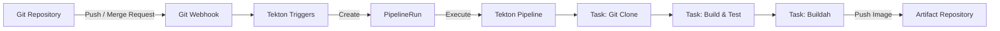

# 2026-10-22

## Today's Focus: CI With Tekton Pipelines

## Category: CI/CD / Tekton / DevOps

### CI Architecture

```mermaid
flowchart LR
    A["Git Repository"]
    B["Git Webhook"]
    C["Tekton Triggers"]
    D["PipelineRun"]
    E["Tekton Pipeline"]
    F["Task: Git Clone"]
    G["Task: Build & Test"]
    H["Task: Buildah"]
    I["Artifact Repository"]

    A -->|Push / Merge Request| B
    B --> C
    C -->|Create| D
    D -->|Execute| E
    E --> F
    F --> G
    G --> H
    H -->|Push Image| I
```
