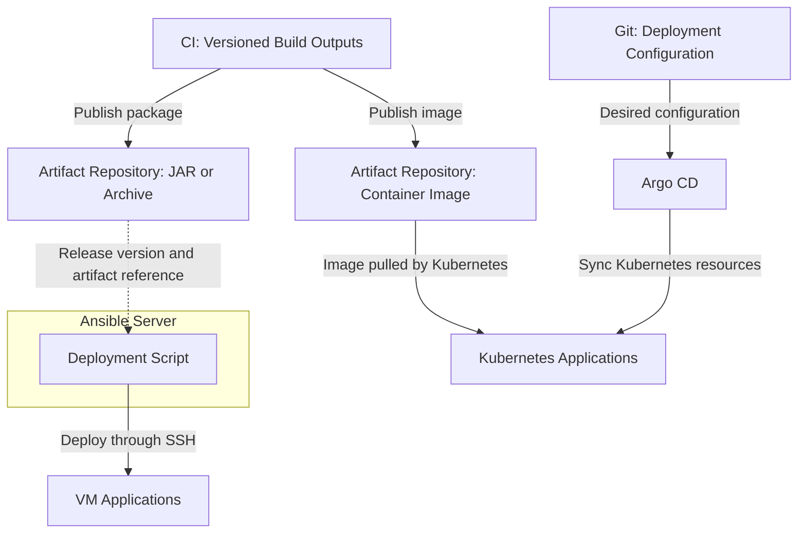

# 2026-10-24

## Today's Focus: CD for Kubernetes and VM Applications

## Category: CI/CD / ArgoCD / Ansible

### CD Architecture

```mermaid
flowchart TB
  CI["CI: Versioned Build Outputs"]
  REG["Artifact Repository: Container Image"]
  ART["Artifact Repository: JAR or Archive"]
  GIT["Git: Deployment Configuration"]
  ARGO["Argo CD"]
  OCP["Kubernetes Applications"]
  VM["VM Applications"]

  subgraph HOST["Ansible Server"]
    VMCD["Deployment Script"]
  end

  CI -->|"Publish image"| REG
  CI -->|"Publish package"| ART
  GIT -->|"Desired configuration"| ARGO
  ARGO -->|"Sync Kubernetes resources"| OCP
  REG -->|"Image pulled by Kubernetes"| OCP
  ART -.->|"Release version and artifact reference"| VMCD
  VMCD -->|"Deploy through SSH"| VM
```
