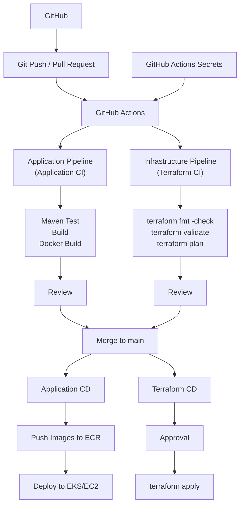

# 2026-10-31

## Today's Focus: Implement CI/CD in management-platform

## CI/CD Architecture

```mermaid
flowchart TB
  GitHub["GitHub"]
  Trigger["Git Push / Pull Request"]
  Actions["GitHub Actions"]
  Secrets["GitHub Actions Secrets"]

  AppCI["Application Pipeline<br/>(Application CI)"]
  InfraCI["Infrastructure Pipeline<br/>(Terraform CI)"]

  AppCheck["Maven Test<br/>Build<br/>Docker Build"]
  InfraCheck["terraform fmt -check<br/>terraform validate<br/>terraform plan"]

  AppReview["Review"]
  InfraReview["Review"]

  Merge["Merge to main"]

  AppCD["Application CD"]
  TerraformCD["Terraform CD"]

  ECR["Push Images to ECR"]
  Approval["Approval"]

  ECS["Deploy to EKS/EC2"]
  Apply["terraform apply"]

  GitHub --> Trigger
  Trigger --> Actions
  Secrets --> Actions

  Actions --> AppCI
  Actions --> InfraCI

  AppCI --> AppCheck
  InfraCI --> InfraCheck

  AppCheck --> AppReview
  InfraCheck --> InfraReview

  AppReview --> Merge
  InfraReview --> Merge

  Merge --> AppCD
  Merge --> TerraformCD

  AppCD --> ECR
  ECR --> ECS

  TerraformCD --> Approval
  Approval --> Apply
```
