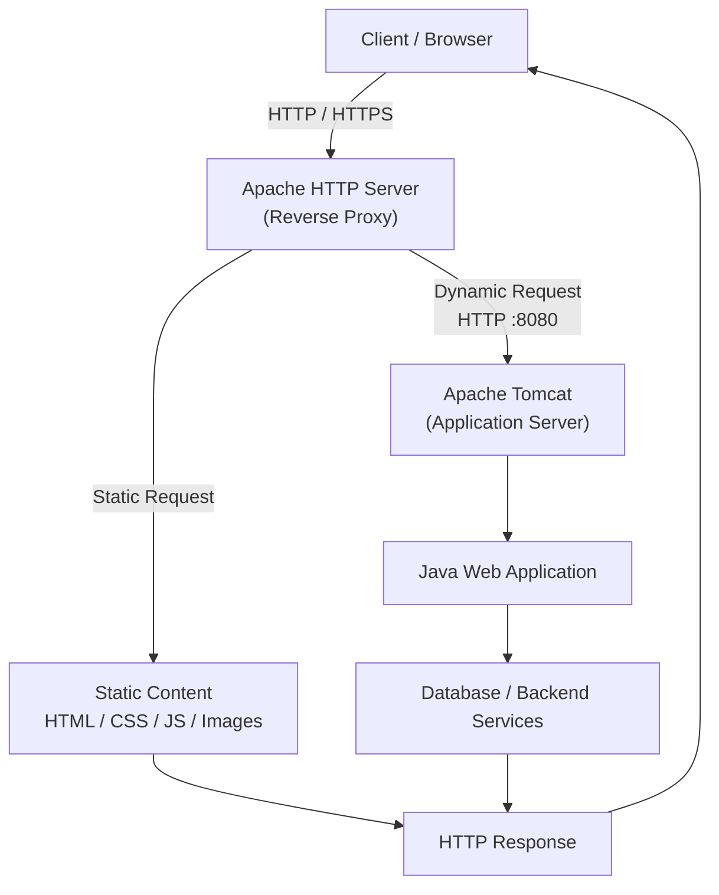

# 2026-11-19

# Today's Focus: Apache HTTP Server and Apache Tomcat

## Architecture

```mermaid

flowchart TD
  A["Client / Browser"] -->|"HTTP / HTTPS"| B["Apache HTTP Server<br/>(Reverse Proxy)"]
  B -->|"Static Request"| C["Static Content<br/>HTML / CSS / JS / Images"]
  B -->|"Dynamic Request<br/>HTTP :8080"| D["Apache Tomcat<br/>(Application Server)"]
  D --> E["Java Web Application"]
  E --> F["Database / Backend Services"]
  C --> G["HTTP Response"]
  F --> G
  G --> A

```
